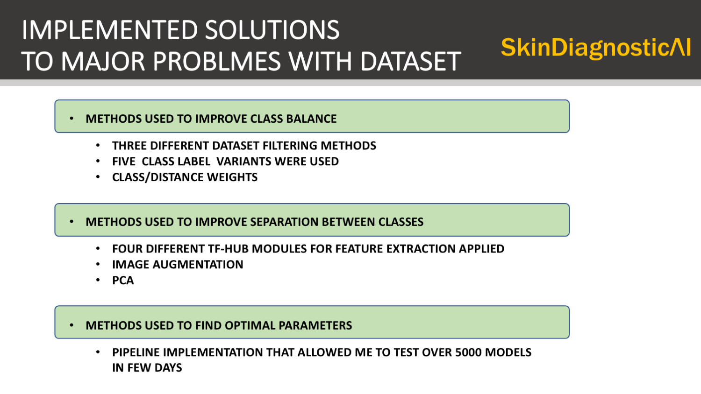

# SkinDiagnosticAI; 
## Detecting Skin Cancer with Low cost devices and AI technology
## Project: Feasibility study with open source data and PyClass AI workbench
      
Author: __Pawel Rosikiewicz, Founder, and Team Leader at SwissAI__  
Contact: prosikiewicz@gmail.com    
License: __MIT__    
ttps://opensource.org/licenses/MIT        
Copyright (C) 2021.01.30 Pawel Rosikiewicz  

## About SkinDiagnosticAI
Skin  Diagnostic AI is an open source project created to develop application for medical specialists that will help identifying potential skin cancer with camera low cost devices, and collect dermatoscopic images for medical community. It will also help to patients to store their images in easy and accessible way on their personal devices, and potentiall provide fast diagnosis, with the risk of cancer estimated based on available images. Furthermore, the application shoudl allow, collecting, clustering and storing mutlitple images from the same patient, thus allowing for faster, and more speciffic patient-doctor interaction. 

more info at: https://simpleai.ch/skin-diagnostic-ai/

## About the project
### Feasibility study   
The goals of the that study were as follow:    
* __Step 1.__ To compare large number of AI models, with different diagnostic purposes using open source data from __Harvard database__
  - to identify main challenges with the dataset used for model training (HAM10000, from Harvard dataverse)       
  - to explore different strategies for data preparation, treatment and feature extraction,
  - to test, of the shelf AI solutions, with extensive grid search, 
  - to develope baseline for further analyses,    
  - to evaluate what statistics and error fucntions should be used for developing final, and ensemble models,
  - to compare different methods for results presentation that are most usefull for medical experts and non-medical users
* __Step 2.__ to evaluate __business value proposition__ of different models, and consult them with users and domain experts 
* __Step 3.__ __to deploy the pipeline__ with selected models on the cloud, and use it as __Proof of Concept__ produc, that can be used to generate actionable results, 
* __Step 4.__ to perform __AI readiness assesment__, and to collect requirement for potential MVP

> The notebooks, and software presented in this repository were used to conduct Step 1, of the SkinDiagnosticAI feasibility study. The slides attached below the text show selected results from all steps, including step 2-4"

## About PyClass, a main tool used to conduct feasibility study
PyClass is an open-sourse, AI workbench for development of classyficaiton models for medical images. It allows for fast, EDA, automated comparison and selection of large number of models, feature extreaction networks, and image classyfication schemas. The piepline, uses only basic, python libraries, such as scipy, tensofrflow, and matplolib, and can be used with python 3.6-3.8. 
PyClass has been developed prior to feasibility study, as part of of the SkinDiagnosticAI initiative. It can be used independepntly to other projects, with minimal code modyffications. 
See how PyClass was used for developeinh reliable classificaiton of vehicles on roads on Swissroads project https://github.com/PawelRosikiewicz/Swissroads

### Introductio to PyClass with SkindDiagnosticAI as a working example 

#### Interact with the code and data examples
I prepared a short introduction to PyClass for Applied Mashine Leanring Days (AMLD 2021),
In this course, you may use PyCklass on HAM10000 interactively, with Renku platform provided by Swiss Data Science Center, SDSC
The same, models and data were used, as with the feasibility study presented on GibHub, except the number fo models and images is considerably smaller (only few hundresds) 

#### to play with the code, follow these instructions:
* Got to: SkinDiagnosticAI, with PyClass implemented at SDCS  
  https://renkulab.io/projects/swissai/amld-2021-workshop
* Click on Environments
* Start new interactive environment (Clink on NEW)
* in new window, set following parameters:
  * Number of CPUs: 2
  * Amount of Memory: 2G
  * leave branch, commit and Def. Environment as they are,
* Click on “Start Environment” button (below parameters)
  * you may wait for preparation of the environment
* Click Connect (blue button on the left)
* Now, you should be connected to virtual environment with Jupiter lab open
* Notebooks 1-4 are in “notebook” folder
  * you may open and try each of them, 
  * all functions, and coffins are in “src” directory 
  * The code was explained on my workshop @AMLD: 
  * My presentation on SkinDiagnosticAI project: https://youtu.be/W624gdkDqRQ?t=491
  * Fully annotated code version is on: GitHub

## Presentation on SkinDiagnosticAI Project
* all images were created wiht PyClass AI workbech
* the slides shows full analyis done on over 5000 compared models and data treatment procedures, 
* Jupyter notebooks in notebook/ folder shows light vervion of that analyis that can be reapeated by the user and build up to any number of compared models, 

